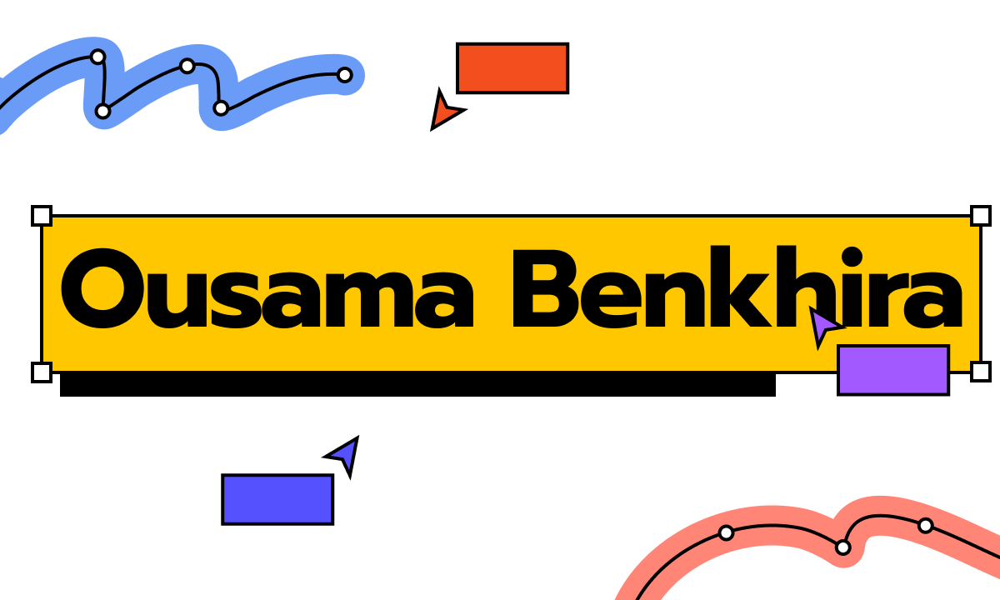

# Ousama-Benkhira
<!-- Banner -->

  

# 👋 ¡Hola! Soy **Ousama Benkhira**

🎓 Estudiante de **Ingeniería Informática** en la UOC · 🛡️ Apasionado por **Ciberseguridad**, **IA** y **Seguridad Digital**  
💬 Me interesa convertir investigación en mensajes útiles para la sociedad · 📚 Aprendiendo cada día

<!-- Badges -->

  
  
  
  

---

## 🔥 Sobre mí

  
Soy un estudiante curioso y comprometido con la tecnología: me encanta entender cómo funcionan las redes, las huellas digitales y los riesgos asociados. Me centro en **investigación**, **concienciación** y creación de recursos que faciliten un uso seguro y responsable de la tecnología.

- 🔍 Investigación y análisis de información  
- 🛡️ Concienciación en seguridad digital  
- 🤖 Fundamentos de IA y aprendizaje supervisado  
- 👥 Trabajo en equipo y documentación clara

---

## 🛠️ Tecnologías y herramientas

- **Lenguajes:** Python · Java · JavaScript  
- **Security / Tools:** Redes básicas · OSINT · Linux · Git · VS Code  
- **IA / ML:** Fundamentos y pipelines sencillos

---

## 🚀 Proyectos destacados

### 🟦 ConCiencia Digital — Proyecto de concienciación
Recurso educativo centrado en la **huella digital** y los riesgos en línea para jóvenes. En la página del proyecto incluyo 3 vídeos:  
- Historia del cibercrimen  
- Cibercrimen en Europa  
- Cibercrimen en España

**Mi participación:** investigación documental, selección de referencias fiables, estructuración de contenidos y redacción de documentación para el público joven.

---

## 📊 Mis estadísticas (generadas automáticamente)

  &show_icons=true&theme=dark&count_private=true" alt="GitHub stats" />
  &nbsp;
  &theme=dark" alt="GitHub streak" />

---

## 📫 Contacto

📧 oboujnine@uoc.edu · 🔗 [LinkedIn](https://www.linkedin.com/in/ousama-benkhira-oujnine-3161b0219/)  
Si quieres colaborar o necesitas ayuda con un proyecto, escríbeme :)

---

> ⭐ *"Aprender es la herramienta más poderosa que puedes llevar al futuro."*  
